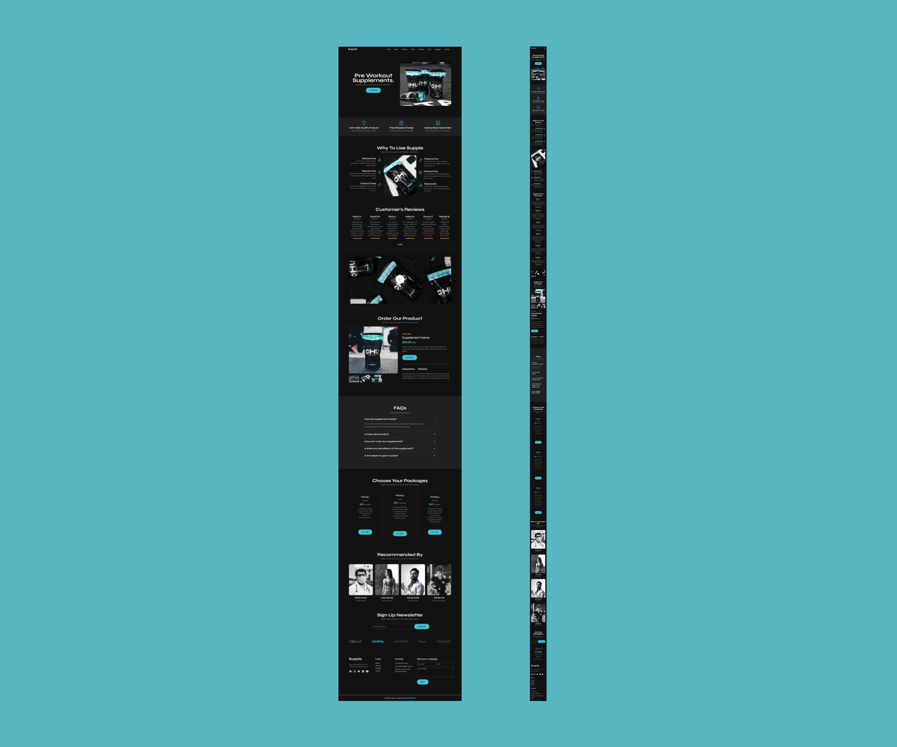

# Supple.

Supple is a modern, responsive web project designed to provide a sleek and user-friendly interface. This project showcases a clean design and interactive features, built to demonstrate front-end development skills using Tailwind CSS and JavaScript.

## Table of contents

- [Overview](#overview)
  - [The challenge](#the-challenge)
  - [Screenshot](#screenshot)
  - [Links](#links)
- [My process](#my-process)
  - [Built with](#built-with)
  - [What I learned](#what-i-learned)
  - [Continued development](#continued-development)
  - [Useful resources](#useful-resources)
- [Author](#author)
- [Acknowledgments](#acknowledgments)

## Overview

### The challenge

- Using tailwind CSS to style the project and make it responsive.

### Screenshot



### Links

- Live Site URL: [Add live site URL here](https://omowunmikamil.github.io/Supple/)

## My process

### Built with

- Semantic HTML5 markup
- Tailwind CSS
- Mobile-first workflow
- JavaScript

### What I learned

Use this section to recap over some of your major learnings while working through this project. Writing these out and providing code samples of areas you want to highlight is a great way to reinforce your own knowledge.

To see how you can add code snippets, see below:

```html
<section
  class="bg-stroke-1 w-screen md:w-screen lg:w-screen lg:py-8 py-12 h-fit mb-20"
>
  <section
    id="faqs"
    class="lg:w-[90%] sm:w-[100%] md:w-[100%] mb-20 px-6 lg:px-12 md-px-6 my-20 mx-auto"
  >
    <h2
      class="text-3xl md:text-3xl lg:text-5xl font-syne font-bold md:font-extrabold lg:font-bold self-stretch leading-[2rem] lg:leading-[2rem] text-center"
    >
      FAQs
    </h2>
    <p class="mt-3 lg:mt-6 text-sm md:text-xl lg:text-base">
      Frequently asked questions.
    </p>
    <section class="flex flex-col items-center mt-6 gap-3">
      <article class="border border-n-8 w-full lg:w-[50rem] px-3">
        <div class="flex justify-between items-center my-4">
          <h3
            class="text-xl md:text-3xl lg:text-2xl font-syne font-semibold text-left"
          >
            How this supplement works?
          </h3>
          
        </div>
        <p
          class="line-clamp-2 text-left pr-12 py-1 mb-4 lg:text-base leading-6 lg:leading-8"
        >
          Et nec ipsum tincidunt ut felis elementum proin eget dignissim egestas
          quis velit maecenas magnis. Etiam faucibus et ultrices sit aliquet
          ultrices.
        </p>
      </article>
      <article class="border border-n-8 w-full lg:w-[50rem] px-3">
        <div class="flex justify-between items-center my-4">
          <h3
            class="text-xl md:text-3xl lg:text-2xl font-syne font-semibold text-left"
          >
            Is there refund policy?
          </h3>
          
        </div>
      </article>
      <article class="border border-n-8 w-full lg:w-[50rem] px-3">
        <div class="flex justify-between items-center my-4">
          <h3
            class="text-xl md:text-3xl lg:text-2xl font-syne font-semibold text-left"
          >
            How can i trust your supplements?
          </h3>
          
        </div>
      </article>
      <article class="border border-n-8 w-full lg:w-[50rem] px-3">
        <div class="flex justify-between items-center my-4">
          <h3
            class="text-xl md:text-3xl lg:text-2xl font-syne font-semibold text-left"
          >
            Is there any side effects of this supplement?
          </h3>
          
        </div>
      </article>
      <article class="border border-n-8 w-full lg:w-[50rem] px-3">
        <div class="flex justify-between items-center my-4">
          <h3
            class="text-xl md:text-3xl lg:text-2xl font-syne font-semibold text-left"
          >
            Is this helpful to gain muscles?
          </h3>
          
        </div>
      </article>
    </section>
  </section>
</section>
```

```css
:root {
  --font-syne: "Syne", sans-serif;
  --font-montserrat: "Montserrat", sans-serif;
  color-scheme: dark;
}

@layer base {
  body {
    @apply font-sans text-base text-n-1;
  }
  a {
    @apply no-underline text-sm md:text-xl lg:text-sm text-n-1 font-montserrat hover:text-color-2 focus:text-color-2;
  }
  p {
    @apply self-stretch font-montserrat text-sm text-center font-light text-n-4 mt-3;
  }
}

@layer components {
  .navbar {
    @apply flex justify-between items-center space-x-3;
  }
  .img {
    @apply fill-current hover:text-color-2;
  }
}
```

```js
function onToggleMenu(e) {
  if (e.name === "menu") {
    e.name = "close";
    navLinks.classList.add("top-[9%]");
    navLinks.classList.remove("top-[-100%]");
  } else {
    e.name = "menu";
    navLinks.classList.add("top-[-100%]");
    navLinks.classList.remove("top-[9%]");
  }
}
```

### Continued development

- All screen responsiveness
- Tailwind transformation and animation
- Screen blur

### Useful resources

- [Templates jungle](https://templatesjungle.com/) - This site provides a lot of free templates that can be used for projects.
- [Tailwind CSS](https://tailwindcss.com/) - Tailwind CSS is a utility-first CSS framework for rapidly building custom designs.

## Author

- Website - [Visit my Portfolio Website](<[https://omowunmikamil.tech](https://omowunmi-kamiludeen.netlify.app/)>)
- Linkedin - [Omowunmi Kamiludeen](https://www.linkedin.com/in/omowunmi-kamiludeen/)
- Twitter - [Browser_Nerd](https://www.twitter.com/@Browser_Nerd)

## Acknowledgments

- [Templates jungle](https://templatesjungle.com/)
